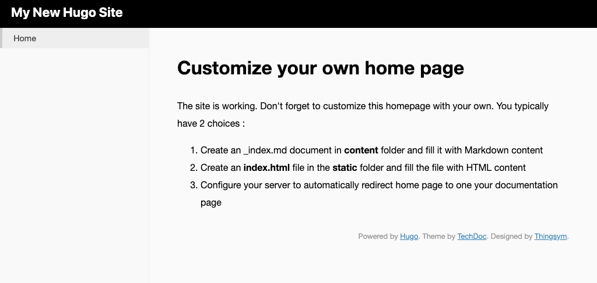
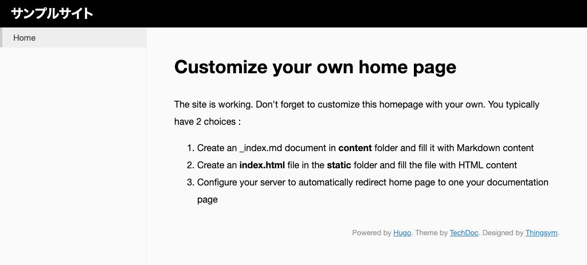

# HUGO でサイトを作る
HUGO でサイトを作成する方法です。
この作業は、新しいサイトを作るときに行います。

---

## サイトの作成
作業用ディレクトリー「Sites」の下に、「example」というサイトを作成してみましょう。

1. 作業用ディレクトリーに移動します。

        # Windows の場合
        $ cd /Hugo/Sites

        # mac の場合
        $ cd ~/Sites

2. `hugo new site サイト名` というコマンドを実行します。

        $ hugo new site example

3. コマンド実行に成功すると、次のような結果が表示されます。

        $ hugo new site example
        Congratulations! Your new Hugo site is created in /Users/username/Sites/example.

        Just a few more steps and you're ready to go:

        1. Download a theme into the same-named folder.
          Choose a theme from https://themes.gohugo.io/ or
          create your own with the "hugo new theme <THEMENAME>" command.
        2. Perhaps you want to add some content. You can add single files
          with "hugo new <SECTIONNAME>/<FILENAME>.<FORMAT>".
        3. Start the built-in live server via "hugo server".

        Visit https://gohugo.io/ for quickstart guide and full documentation.

4. 「Sites」ディレクトリ以下に「example」が作成されていれば OK です。

## テーマの追加

HUGO のテーマを追加します。

テーマとは、Markdown ファイルをビルドして HTML ファイルを生成するためのデザインテンプレートです。
色んな人が作ったテーマ一覧は、[themes.gohugo.io](https://themes.gohugo.io/) で確認できます。

今回は、[techdoc theme](hhttps://github.com/thingsym/hugo-theme-techdoc) を利用してみましょう。

テーマファイルはリポジトリとして公開されているので、`git submodule add リポジトリURL themes/テーマ名` コマンドで、「themes」下に追加します。

    $ cd example
    $ git init
    $ git submodule add https://github.com/thingsym/hugo-theme-techdoc.git themes/techdoc

!!! Note
    サブモジュールを使うと、外部のリポジトリを別のリポジトリに取り込みできます。サブモジュールのリポジトリが更新された場合には `git pull` コマンドで更新内容を反映できます。

!!! Note
    Github.com から zip をダウンロードして解凍したファイルを、直接「themes」以下に置くこともできます。この場合は、サブモジュールのように元のリポジトリが更新されても更新差分の反映はできません。

## 開発サーバーでの確認

ローカルに開発サーバを立ち上げて、サイトを確認します。

1. 開発サーバーを立ち上げて確認するには `hugo server -t テーマ名` コマンドを実行します。
`-t テーマ名` はテーマを指定して開発サーバを立ち上げるオプションです。

        $ hugo server -t techdoc

1. `http://localhost:1313/` に開発サーバーが立ち上がります。

        $ hugo server -t techdoc

                      | EN
        +------------------+----+
        Pages            |  7
        Paginator pages  |  0
        Non-page files   |  0
        Static files     |  5
        Processed images |  0
        Aliases          |  0
        Sitemaps         |  1
        Cleaned          |  0
        Total in 10 ms

        Watching for changes in /Users/username/Sites/example/{archetypes,content,data,layouts,static,themes}
        Watching for config changes in /Users/username/Sites/example/config.toml
        Environment: "development"
        Serving pages from memory
        Running in Fast Render Mode. For full rebuilds on change: hugo server --disableFastRender
        Web Server is available at http://localhost:1313/ (bind address 127.0.0.1)
        Press Ctrl+C to stop

1. ブラウザで `http://localhost:1313/` にアクセスすると、テーマが適用されたサイトを確認できます。

    

!!! Note
      - ディレクトリ下のファイルに変化があった場合（記事の追加・設定の変更）、自動でビルドされます。
      - 開発サーバーは `Ctrl + C`（mac の場合は `command + C`）で終了します。

!!! warning
    変更が反映されないことがあります。その時は、再度ローカルサーバを立ち上げましょう。

## テーマの設定

開発サーバを起動するときに毎回オプションでテーマを指定するのは大変なので、設定ファイルで、利用するテーマを設定します。

1. サイトディレクトリ直下の `config.toml` をテキストエディタで開きます。
ファイルに設定を追加します。

        :::toml
        baseURL = "http://example.org/"
        languageCode = "en-us"
        title = "My New Hugo Site"
        # 以下を追記
        theme = "techdoc"

1. `-t` オプションを付けずに開発サーバを起動できます。

        $ hugo server

## サイトの設定の変更
`config.toml` はサイトの設定ファイルです。
HUGO 標準の設定や、テーマ独自の設定があるときにはこのファイルに記述します。

ためしに、サイト名を変更してみましょう。

1. `config.toml` の `title` パラメータの値を変更して、サイト名を変更します。

        :::toml
        baseURL = "http://example.org/"
        languageCode = "en-us"
        title = "サンプルサイト"
        theme = "techdoc"

1. 「techdoc」はヘッダーにサイト名を表示するテーマだったので、ヘッダーが「サンプルサイト」に変更されました。

    
