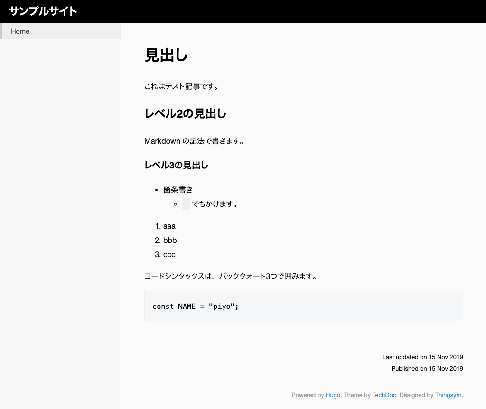
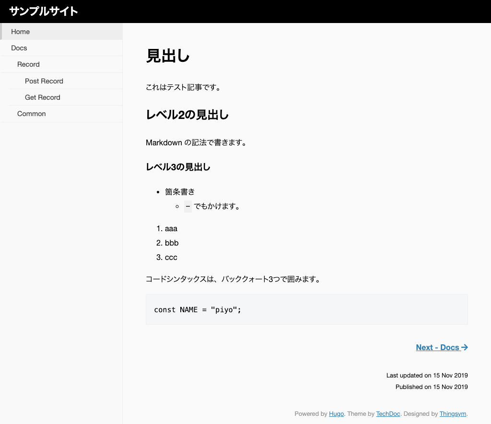

# コンテンツ（記事）を作成する

コンテンツとなる記事を作成する方法です。

---
## ファイルの追加
### 概要
コンテンツファイルは「content」ディレクトリーの下に追加します。

### 手順

1. コンテンツを追加するには、`hugo new ファイル名.md` コマンドを実行します。

        :::bash
        $ hugo new _index.md

1. 「content」ディレクトリーの下に `_index.md` が作成されます。

        :::bash
        $ hugo new _index.md
        /Users/username/Sites/example/content/docs/common.md created
        .
        ├── ...
        ├── content
        │   └── _index.md
        ├── ...

1. `_index.md` を開いて編集します。

        :::yaml
        ---
        title: ""
        date: 2019-11-15T12:56:53+09:00
        draft: true
        ---

    !!! Note
        -  「---」で囲われた部分を、**Front matter** と呼びます。
        -  Front matter には記事のメタ情報を記載します。
        -  記事の中身は Front matter より下に記載します。

2. 記事タイトルを入力します。Front matter の `title` に値を設定します。

        :::yaml hl_lines="2"
        ---
        title: "Hello World"
        date: 2019-11-15T12:56:53+09:00
        draft: true
        ---

3. 下書きフラグ `draft` を `false` にして、ファイルがビルドされるようにします。

        :::yaml hl_lines="4"
        ---
        title: "Hello World"
        date: 2019-11-15T12:56:53+09:00
        draft: false
        ---

4. 記事の内容を Front matter 以下に記述します。

        :::yaml hl_lines="7 8 9 10 11 12 13 14 15 16 17 18 19 20 21 22 23 24 25 26"
        ---
        title: "Hello World"
        date: 2019-11-15T14:57:21+09:00
        draft: false
        ---

        # 見出し
        これはテスト記事です。

        ## レベル2の見出し
        Markdown 記法で書きます。

        ### レベル3の見出し

        * 箇条書き
          - `-` でもかけます。

        1. aaa
        2. bbb
        3. ccc

        コードシンタックスは、バッククォート3つで囲みます。

        ```
        const NAME = "piyo";
        ```

5. ファイルの変更を上書き保存し、もう一度ブラウザで確認します（開発サーバを起動済みの場合は、以下のコマンドは不要です）。

        :::bash
        $ hugo server

6. 記事の内容が反映されました。

    

!!! Note
    #### Front matter について
    Front matter は、YAML 形式、TOML 形式、または JSON 形式で定義できます。

    |パラメータ |説明|備考
    |:--|:--|:--
    |title |記事のタイトル|
    |date |記事の日付|省略可能ですが、ブログなど作成日時でソートしたい場合などはつけたほうが良いです。
    |draft |下書きフラグ|- 本番に記事を反映するには値を `true` にするか、`draft` パラメータを省略します。<br>- 下書き状態でプレビューする場合は `hugo serve -D` として `- D`オプションを指定します。

    その他 HUGO 標準で指定できる値は、[Front matter](https://gohugo.io/content-management/front-matter/) に記載されています。

!!! Note
    `hugo new ファイル名.md` コマンドで追加しなくても、「content」ディレクトリ以下にファイルを作成し、Front matter を追記することでも記事を追加できます。

## セクションの追加
### 概要
HUGO では、「content」ディレクトリーの下にフォルダーを追加し、階層構造を作ることができます。
このときの階層を「セクション」と呼びます。

    :::bash
    content
    ├── docs # Section
    │   └── record # Section
    │   │   ├── get-record.md
    │   │   ├── post-record.md
    │   │   └── _index.md
    │   ├── common.md
    │   └── _index.md
    ├── tips # Section
    │   └── ...
    └──_index.md

### 手順

1. 「techdoc」のv0.4 以降からセクションツリーを表示するには`menu_style` プロパティを `config.toml` に追記します。

        :::toml hl_lines="6 7"
        baseURL = "http://example.org/"
        languageCode = "en-us"
        title = "サンプルサイト"
        theme = "techdoc"

        [Params]
        menu_style = "open-menu"

2. `hugo new ファイル名` コマンドで、docs のトップページと common ページのファイルを追加します。

        :::bash
        $ hugo new docs/_index.md
        $ hugo new docs/common.md

    !!! Note
        - セクションの LP（**セクションページ**）のファイル名は、`_index.md` にします。
        - それ以外は好きに付けることができます。ファイル名はサイトのページ URL になります。
            - ファイル名が「docs/common.md」の場合、URL は「https://example.com/docs/common/」です。

3. さらにその下の階層も作ってみましょう。

        :::bash
        $ hugo new docs/record/_index.md
        $ hugo new docs/record/get-record.md
        $ hugo new docs/record/post-record.md

4. 最終的に「content」以下の構成は、次のようになります。

        :::bash
        content
        ├── docs # Section
        │   └── record # Section
        │   │   ├── get-record.md
        │   │   ├── post-record.md
        │   │   └── _index.md
        │   ├── common.md
        │   └── _index.md
        └──_index.md

5. 「docs」セクションの下に「record」セクションが追加されました。

6. 作成したファイルを適当に編集します。
ただし、`draft` の値は `false` に変更して下書きモードをオフにします。

8. ブラウザ（開発サーバを起動済みの場合は、以下のコマンドは不要です）で確認します。

    
