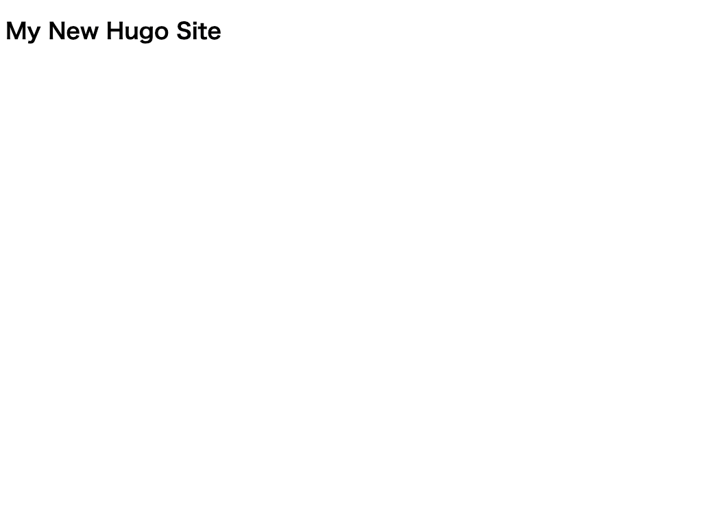
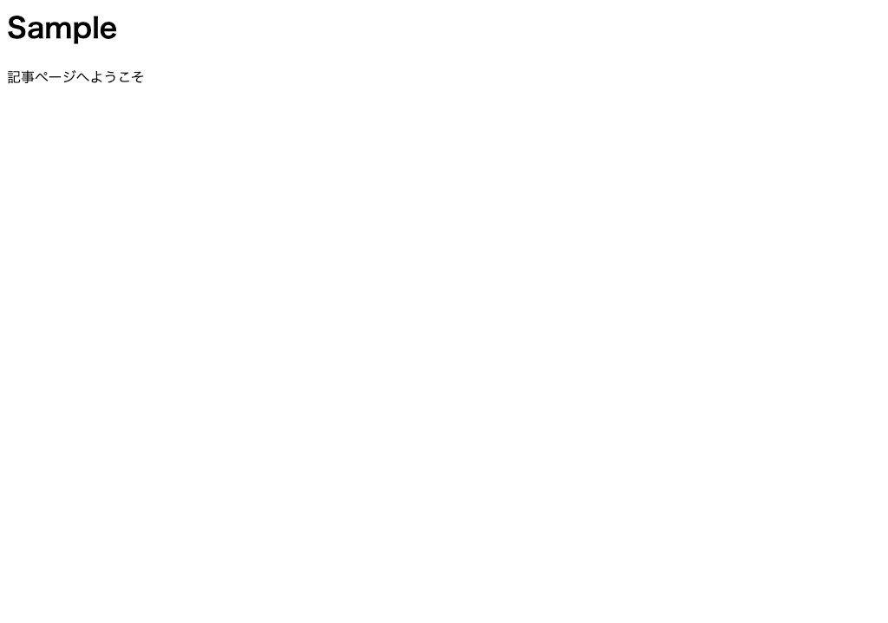
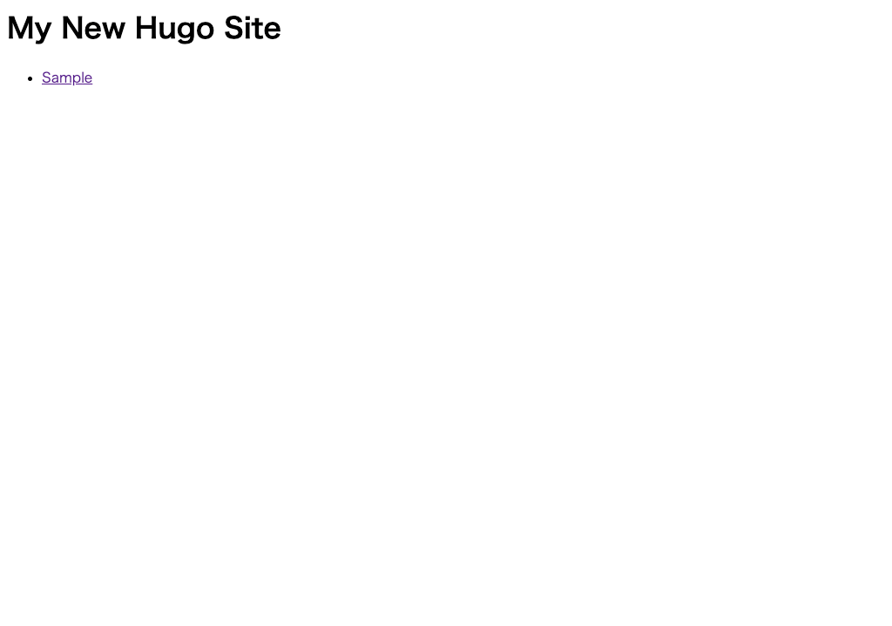

# テーマテンプレートを作る
オリジナルのテーマテンプレートを作ります。

---

## テーマの作成

1. コンソールで `/Hugo/Sites/theme_tutorial` に移動します。

1. HUGO でテーマを作成するには、 `hugo new theme テーマ名` というコマンドを実行します。

        :::bash
        $ hugo new theme mytheme

2. 「themes」ディレクトリの下に「mytheme」が作成されていれば OK です。

3. サンプルサイトで「mytheme」を使うように設定しましょう。次のコマンドで「theme_tutorial」をプロジェクトルートとして VSCode を開きます。

        :::bash
        # Windows の人は「~/Sites」を「/Hugo/Sites/」に読み替えてください
        $ code ~/Sites/theme_tutorial

4. `config.toml` をエディタで開きます。

5. `theme` プロパティで作成した「mytheme」を指定します。

        :::toml hl_lines="4"
        baseURL = "http://example.org/"
        languageCode = "en-us"
        title = "サンプルサイト"
        theme = "mytheme"

6. 開発サーバを起動します。

        :::bash
        $ hugo server

## トップのテンプレート作成
サイトのトップページ（ホームページ）にサイト名を表示してみましょう。

1. `mytheme/layouts/index.html` をエディタで開きます。

2. 見出しタグを記載します。

        :::html
        <h1>{{ .Site.Title }}</h1>

3. ブラウザで `http://localhost:1313` へアクセスし、サイトを確認します。
次のように表示されていれば OK です。

    

!!! Note
    サイトの情報は `.Site.変数名` で呼び出しします。このサイトの情報は `config.toml` で定義した内容です。
    参照: [Site Variables](https://gohugo.io/variables/site/)

## 記事ページのテンプレート作成

記事ページに記事のタイトルと本文を表示してみましょう。

1. `mytheme/layouts/_default/single.html` をエディタで開きます。

1. 次の内容を記載します。

        :::html
        <h1>{{ .Title }}</h1>
        {{ .Content }}

1. このままだと表示対象のコンテンツファイルがないので、コンテンツファイルを作成します。「content」ディレクトリ以下に「sample.md」が作成されます。

        :::bash
        $ hugo new sample.md

1. 「sample.md」を開きます。次のように編集して、ファイルを保存します。

        :::yaml hl_lines="4 6 7"
        ---
        title: "Sample"
        date: 2019-11-18T11:50:00+9:00
        draft: false
        ---

         記事ページへようこそ

1. ブラウザで `http://localhost:1313/sample/` へアクセスし、サイトを確認します。
次のように表示されていれば OK です。

    

## 一覧のテンプレート作成
トップページに記事一覧を表示してみましょう。

1. `mytheme/layouts/index.html` をエディタで開きます。
2. [トップのテンプレート作成](02_create-quick-theme.md#トップのテンプレート作成) で編集した内容に、以下を追記します。

        :::html hl_lines="2 3 4 5 6"
        <h1>{{ .Site.Title }}</h1>
        <ul>
          {{ range .Site.RegularPages }}
          <li><a href="{{ .RelPermalink }}">{{ .Title }}</a></li>
          {{ end }}
        </ul>

3. ブラウザで `http://localhost:1313/` へアクセスし、サイトを確認します。
次のように表示されていれば OK です。

    
