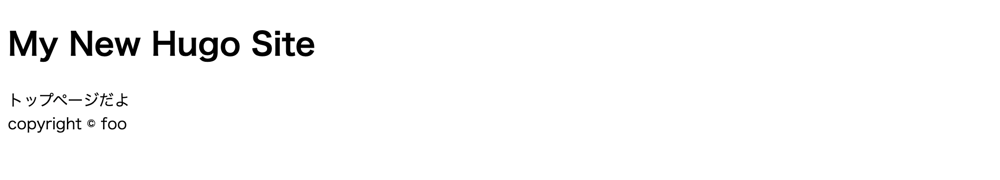
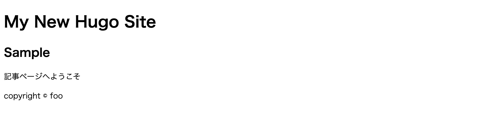

# テンプレートを部品化する

テンプレートファイルは部品化すると管理しやすくなります。

---

## パーシャルテンプレート

### 概要
サイトにおいて、各ページで共通する部品があることがあります。

- ヘッダー
- フッター
- サイドバーのナビゲーション

こういった共通する部品は、部品化しておくとテンプレートの記述をシンプルにできます。
HUGO ではこれらの部品化したテンプレートのことを「[**パーシャルテンプレート**](https://gohugo.io/templates/partials/)」と呼びます。

### 部品化してみる

たとえば次のような トップページの HTML を作りたいとします。
このヘッダー部分とフッター部分を部品化してみましょう

    :::html
    <!DOCTYPE html>
    <html lang="{{ .Site.LanguageCode }}">
      <head> <!-- ここはヘッダー -->
        <meta charset="UTF-8">
        <link rel="stylesheet" href="/css/main.css">
        <title>{{ if not .IsHome }}{{ .Title }} | {{ end }}{{ .Site.Title }}</title>
      </head>
      <body>
        <main class="main">
          トップページだよ
        </main>
        <footer>copyright © {{ .Site.Copyright }}</footer> <!-- ここはフッター -->
      </body>
    </html>

パーシャルテンプレートのファイルは「layouts/partials」以下に配置します。ファイル名は任意でつけることができます。

* `themes/mytheme/layouts/partials/header.html` を開いて、以下を記述します。

        :::hugo
        <h1>{{ .Site.Title }}</h1>

* `themes/mytheme/layouts/partials/footer.html` を開いて、以下を記述します。

        :::hugo
        {{ .Site.Copyright }}

* `themes/mytheme/layouts/index.html` を開いて、以下を記述します。

        :::hugo hl_lines="10 16"
        <!DOCTYPE html>
        <html lang="{{ .Site.LanguageCode }}">
          <head>
            <meta charset="UTF-8">
            <link rel="stylesheet" href="/css/main.css">
            <title>{{ if not .IsHome }}{{ .Title }} | {{ end }}{{ .Site.Title }}</title>
          </head>
          <body>
            <header>
            {{ partial "header.html" . }}
            </header>
            <main class="main">
              トップページだよ
            </main>
            <footer>
            {{ partial "footer.html" . }}
            </footer>
          </body>
        </html>

他のテンプレートからパーシャルテンプレートを呼び出す場合は、`{{ partial "<PATH>/<FILE_NAME>.html" . }}` と記述します。パス名は `layouts/partials` 以降のパスです。

## ベーステンプレート

### 概要

さきほど定義した、トップページにあたる`index.html` には `<html>`タグや`<head>`タグ内のヘッダ情報などが含まれています。
この場合、記事ページにあたる`single.html` や一覧ページの`list.html` にも同じように`<html>`タグなどの記述が必要です。

`<html>`タグなどはサイトで共通なので、`index.html` には`<main>`タグの中身（トップページに書きたいコンテンツ）だけにして、共通部分は別に定義してみましょう。

このとき利用するのが、[ベーステンプレート](https://gohugo.io/templates/base/)です。ベーステンプレートは `/layouts/_default/baseof.html` に記述します。

### 部品化してみる

* `themes/mytheme/layouts/index.html` を開いて、以下のように修正します。

        :::hugo
        {{ define "main" }}
          トップページだよ
        {{ end }}

* `themes/mytheme/layouts/_default/single.html` を開いて、以下を記述します。

        :::hugo
        {{ define "main" }}
          <h2>{{ .Title }}</h2>
          {{ .Content }}
        {{ end }}

* `themes/mytheme/layouts/_default/baseof.html` を開いて、以下のように修正します。

        :::hugo hl_lines="13"
        <!DOCTYPE html>
        <html lang="{{ .Site.LanguageCode }}">
          <head>
            <meta charset="UTF-8">
            <link rel="stylesheet" href="/css/main.css">
            <title>{{ if not .IsHome }}{{ .Title }} | {{ end }}{{ .Site.Title }}</title>
          </head>
          <body>
            <header>
            {{ partial "header.html" . }}
            </header>
            <main class="main">
            {{ block "main" . }} {{ end }}
            </main>
            <footer>
            {{ partial "footer.html" . }}
            </footer>
          </body>
        </html>

`{{ define "定義名" }} ... {{ end }}` で定義した内容を呼び出すには、`{{ block "定義名" . }} {{ end }}` として記述します。

## 動作確認

動作確認してみましょう。

1. フッター部分で`{{ .Site.Copyright }}` とサイト設定の変数を呼び出しているので、`config.toml` に `copyright` を追記します。

        :::toml hl_lines="5"
        baseURL = "http://example.org/"
        languageCode = "en-us"
        title = "My New Hugo Site"
        theme = "mytheme"
        copyright = "copyright © foo"

2. 開発サーバを起動します。

        :::bash
        $ hugo server

3. `http://localhost:1313/` および `http://localhost:1313/sample/` にアクセスします。

    * http://localhost:1313/
       

    * http://localhost:1313/sample/
       
