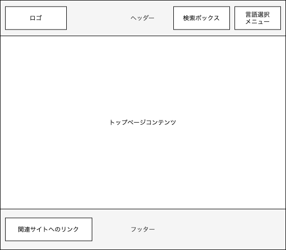
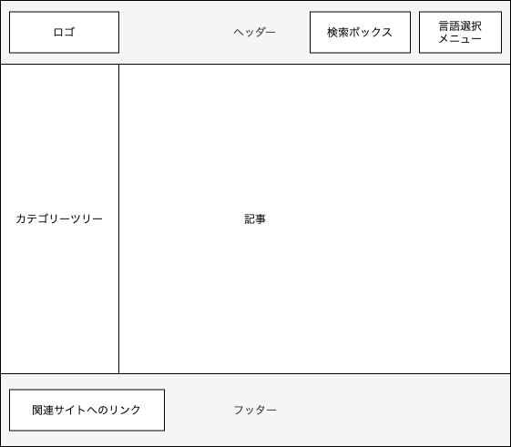
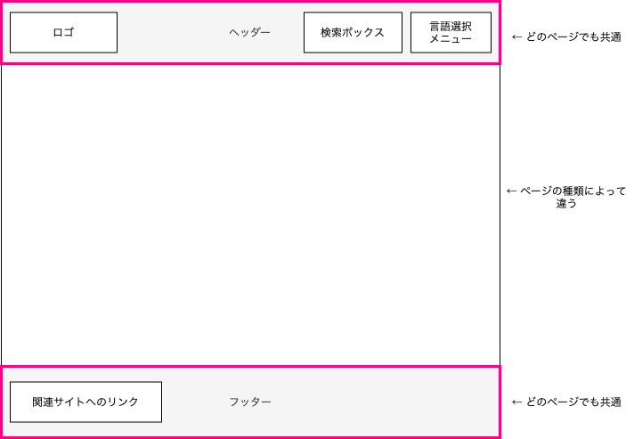
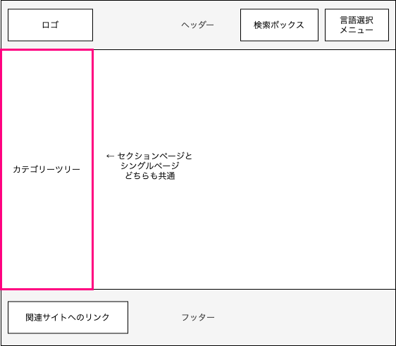

# ドキュメントサイトのテンプレートを作る

実際にテーマテンプレートを作ってみましょう。

---

## ゴール

次のワイヤフレームをもつサイトを作ります。

- ホームページ（トップページ）)

    {: style="width:450px"}

- セクションページ（記事一覧ページ）

    {: style="width:450px"}

- シングルページ（記事ページ）

    {: style="width:450px"}

## 方針
共通部分を切り出してみましょう。

- サイト全体に共通して、ヘッダーとフッターを含んでいます。

    {: style="width:500px;border:none;"}

    - [ベーステンプレート](..//02_theme/06_partial.md#_5)を使って定義し、ページの種類によって中央部分の内容が変わるようにテンプレートを作ります。
    - さらにテンプレートの記述をシンプルにするため、ヘッダーとフッターは[パーシャルテンプレート](../02_theme/06_partial.md#_2)として部品化したものを呼び出したほうがよさそうです。

- セクションページとシングルページを見比べると、カテゴリーツリーは共通しています。

    {: style="width:500px;border:none;"}

    - カテゴリーツリー部分も共通なので、[パーシャルテンプレート](../02_theme/06_partial.md#_2)として部品化したものを呼び出すとよさそうです。
