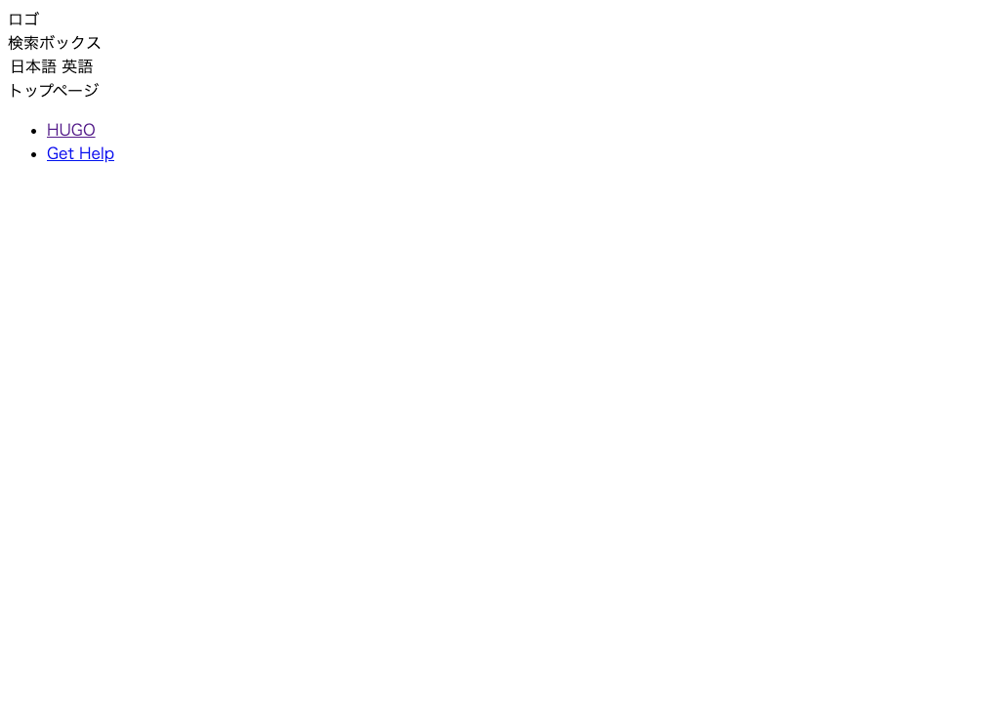

# ベース部分を作る

サイト全体のベース部分と、ヘッダー・フッター、各テンプレートの大枠部分を作成していきましょう。

---

## ベーステンプレート

`mytheme/layouts/_default/baseof.html` を開いて、以下に書き換えます。

    :::hugo
    <!DOCTYPE html>
    <html lang="{{ .Site.LanguageCode }}">
      <head>
        {{ partial "head.html" . }}
      </head>
      <body>
        <header>
        {{ partial "header.html" . }}
        </header>
        <main id="main">
        {{ block "main" . }} {{ end }}
        </main>
        <footer>
        {{ partial "footer.html" . }}
        </footer>
      </body>
    </html>

- `<head>` の内容（`head.html`）、ヘッダー（`header.html`）およびフッター（`footer.html`）はパーシャルテンプレートを読み込みます。
- ページの種類によって中央部分の内容は異なるので、各ページテンプレートで定義した `main`（[部分テンプレート定義](../03_hugo-template-syntax/02_base2.md#_14)）を呼び出します。

## `<head>` の部分テンプレート

`mytheme/layouts/partials/head.html` を開いて、以下に書き換えます。

`<head>` 内では、HTML のメタ情報や `css` などの読み込みを行います。読み込んでいる css ファイルについてはあとで作成します。

    :::hugo
    <meta charset="UTF-8">
    <link rel="stylesheet" href="{{ "css/reset.css" | relURL }}">
    <link rel="stylesheet" href="{{ "css/default.css" | relURL }}">
    <title>{{ if not .IsHome }}{{ .Title }} | {{ end }}{{ .Site.Title }}</title>

## ヘッダーの部分テンプレート

`mytheme/layouts/partials/header.html` を開いて、以下に書き換えます。

    :::hugo
    

      <nav class="header-logo">
      ロゴ
      </nav>
      

        <nav class="search-box">
        検索ボックス
        </nav>
      

      <option class="language">
        <select name="language" onChange="location.href=value;">
          <option value="aaa.html">日本語</option>
          <option value="bbb.html">英語</option>
        </select>
      </option>
    

## フッターの部分テンプレート

`mytheme/layouts/partials/footer.html` を開いて、以下に書き換えます。

    :::hugo
    

      <nav class="relevant-sites">
        <ul>
          <li><a href="https://gohugo.io/">HUGO</a></li>
          <li><a href="https://discourse.gohugo.io/">Get Help</a></li>
        </ul>
      </nav>
    

## ホームページのテンプレート

`mytheme/layouts/index.html` を開いて、以下に書き換えます。

    :::hugo
    {{ define "main" }}
    

      トップページ
    

    {{ end }}

## リストページのテンプレート

`mytheme/layouts/_default/list.html` を開いて、以下に書き換えます。

    :::hugo
    {{ define "main" }}
    {{ partial "nav.html" . }}
    

      {{ partial "nav.html" . }}
      list
    

    {{ end }}

## シングルページのテンプレート

`mytheme/layouts/_default/single.html` を開いて、以下に書き換えます。

    :::hugo
    {{ define "main" }}
    

      {{ partial "nav.html" . }}
      <article>
        <h1>{{ .Title }}</h1>
        {{ .Content }}
      </article>
    

    {{ end }}

## カテゴリーツリーの部分テンプレート

`mytheme/layouts/partials/nav.html` を開いて、以下に書き換えます。

    :::hugo
    <nav class="nav">
    カテゴリツリー
    </nav>

## 動作確認

開発サーバを起動して確認してみましょう。

    :::bash
    # /Hugo/Sites/theme_tutorial 内
    $ hugo server

    # http://localhost:1313/ と https://localhost:1313/sample/ にアクセスして確認

- ホームページ（`http://localhost:1313/`）

    

- シングルページ（`http://localhost:1313/sample/`）

    
