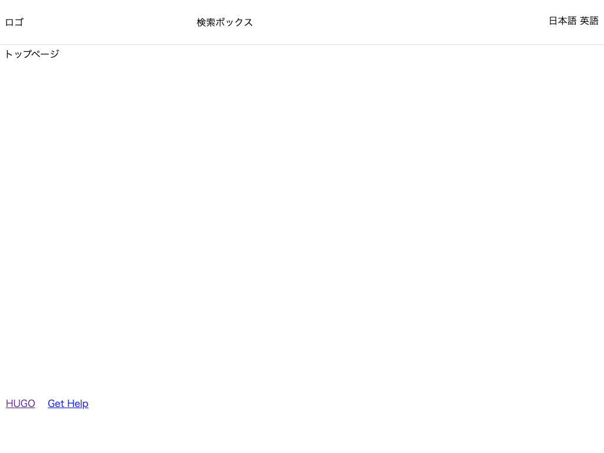

# CSS を適用する

CSS を適用してみましょう。

CSS ファイルは すでに `mytheme/layouts/partials/head.html` で読み込まれるように設定しているので、ファイルを置きます。
静的ファイルは、`テーマ名/static/` の下に置くことで読み込まれます。

---

## `reset.css`

リセットCSS は、ブラウザごとに異なる CSS を打ち消して、ブラウザ間の表示差異をなくすための CSS です。
今回は、HTML Doctor Reset CSS を使います。

1. [https://code.google.com/archive/p/html5resetcss/downloads](https://code.google.com/archive/p/html5resetcss/downloads
) から `html5reset-1.6.1.css` をダウンロードします。
2. ダウンロードしたファイルを `reset.css` に変更します。
3. `mytheme/static/css` の下に置きます。

## `default.css`

自分で定義する CSS は `default.css` に記述していくことにします。

    :::css
    .header {
      height: 75px;
      margin: 0 auto;
      border-bottom: 1px solid #ddd;
      display: flex;
      justify-content: space-between;
      align-items: center;
    }

    .search-box {
      width: 300px;
    }

    .home {
      margin: 0 auto;
      display: flex;
      min-height: 600px;
    }

    .content {
      margin: 0 auto;
      display: flex;
      min-height: 600px;
    }

    .list {
      margin: 0 auto;
      display: flex;
      min-height: 600px;
    }

    .nav {
      width: 300px;
    }

    .footer {
      height: 75px;
      margin: 0 auto;
      border-top: 1px solid #ddd;
      display: flex;
      justify-content: space-between;
      align-items: center;
    }

    .relevant-sites li {
      display: inline-block;
      margin-right: 1rem;
    }

## 動作確認

開発サーバを起動して確認してみましょう。

    :::bash
    # /Hugo/Sites/theme_tutorial 内
    $ hugo server

    # http://localhost:1313/ にアクセスして確認

CSS が適用されました。

