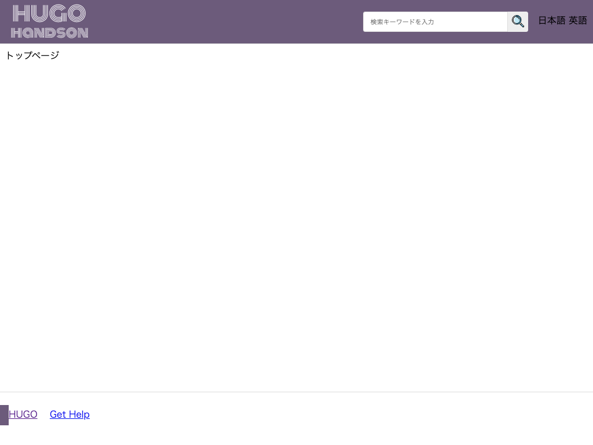

# ヘッダーを作成する

ヘッダー部分を作りこんでいきます。

---

## ロゴ

サイトをカスタマイズするときに、テーマテンプレートを修正するのは手間がかかります。
サイトごとに変更するようなロゴなどは、設定ファイルで変更できるようにします。

### 設定ファイル

1. `config.toml` を開きます。
1. `[params]` セクションを追加し、パラメータ `logo` パラメータを追加します。値には、画像のパスを指定します。

        :::toml hl_lines="6 7"
        baseURL = "http://example.org/"
        languageCode = "en-us"
        title = "My New Hugo Site"
        theme = "mytheme"

        [params]
        logo = "/img/logo.svg"

!!! Note
    テーマオリジナルの設定を追加するときには、`[params]` セクションに設定値を追加します。

### ロゴファイルの配置

画像は静的ファイルなので、`テーマ名/static` の下に置きます。

1. 次の画像を `logo.svg` というファイル名で保存します。

    {: style="width:100px;"}

1. `mytheme/static/` の下に `img` ディレクトリを作成し、その中に `logo.svg` を置きます。

### テンプレートの修正

`mytheme/layouts/partials/header.html` を開いて、黄色の部分を追加します（一部抜粋）。

    :::hugo hl_lines="3 4 5 6"
    

      <nav class="header-logo">
        <a href="/">
          {{ with .Site.Params.logo }}
          {{ else }}{{ .Site.Title }}{{ end }}
        </a>
      </nav>
      

      ...

!!! Note
    `[params]` セクション追加した設定値は `Site.Params.変数名` で呼び出しできます。

### css の修正
ロゴの色が薄いので、フッター部分に背景色をつけます。ロゴも左寄せになっているので、余白を追加します。

`mytheme/static/css/default.css` を開き、黄色の部分を追記します。

    :::css hl_lines="8 11 12 13"
    .header {
      height: 75px;
      margin: 0 auto;
      border-bottom: 1px solid #ddd;
      display: flex;
      justify-content: space-between;
      align-items: center;
      background-color: #6c5b7b;
    }

    .header-logo {
      margin-left: 10px;
    }

### 動作確認

開発サーバを起動して確認してみましょう。

    :::bash
    # /Hugo/Sites/theme_tutorial 内
    $ hugo server

    # http://localhost:1313/ にアクセスして確認

ヘッダーの背景色が変わり、ロゴが追加されました。

## 検索ボックスの追加

検索フォームを追加します。

### テンプレートの修正

`mytheme/layouts/partials/header.html` を開いて、黄色の部分を追加します。

    :::hugo hl_lines="3 4 5 6 7 8 9 10 11"
      ...
      </nav>
      

        <nav class="search-box">
          <form action="{{ "/search_result" | relURL }}">
            <input type="text" name="q" aria-label="search" class="search-input" {{ with .Site.Params.search_placeholder }}placeholder="{{ . }}"{{ end }}>
            <input type="hidden" value="検索">
            <button type="submit" class="search-button"></button>
          </form>
        </nav>
      

      <nav class="language">
      ...

### 検索アイコンの配置

1. 次の画像を `search.svg` というファイル名で保存します（画像は[Flaticon](flaticon.com/)より）

    {: style="width:50px;"}

1. `mytheme/static/` の下に `img` ディレクトリを作成し、その中に `search.svg` を置きます。

### css の修正

`mytheme/static/css/default.css` を開き、黄色の部分を追記します。

    :::css hl_lines="5 6 7 8 9 10 11 12 13 14 15 16 17 18 19 20 21 22 23 24 25 26"
    .search-box {
      width: 300px;
    }

    .search-box form {
      display: flex;
    }

    .search-input {
      width: 250px;
      height: 35px;
      box-sizing: border-box;
      border: 1px solid #ddd;
      border-top-left-radius: 4px;
      border-bottom-left-radius: 4px;
      padding-left: 12px;
    }

    .search-button {
      width: 35px;
      height: 35px;
      background-color: #eee;
      border: 0;
      border-top-right-radius: 4px;
      border-bottom-right-radius: 4px;
    }

### 設定ファイル

検索ボックスのプレースホルダーを設定ファイルで変更できるようにします。

1. `config.toml` を開きます。
1. パラメータ `search_placeholder` パラメータを追加します。値には、画像のパスを指定します。

        :::toml hl_lines="8"
        baseURL = "http://example.org/"
        languageCode = "en-us"
        title = "My New Hugo Site"
        theme = "mytheme"

        [params]
        logo = "/img/logo.svg"
        search_placeholder = "検索キーワードを入力"

### 検索結果ページ

検索ボックスで検索したときに表示する検索結果ページを作ります。

#### テンプレート

1. `mytheme/layouts/` の下に `search_result` ディレクトリを作成します。
1. 作成した `search_result` の下に、`single.html` を作成します。
1. 次の HTML を追記します。

        :::hugo
        {{ define "main" }}
        

          <article>
            <h1>{{ .Title }}</h1>
          </article>
        

        {{ end }}

!!! Note
    検索結果は独自のテンプレートを使いたいので、「`search_result`」という個別タイプのテンプレートを作ります（参照：[シングルページテンプレート](../2_theme/04_kind-template.md#_6)）

### 検索結果ページファイル

ページの実体を作ります。

1. `content` 以下に `search_result.md` を作成します。
1. `search_result.md` を開き、次の内容に修正します。

        :::yaml
        ---
        title: "検索結果"
        type: "search_result"
        ---

### 動作確認

開発サーバを起動して、検索を試してみましょう。

    :::bash
    # /Hugo/Sites/theme_tutorial 内
    $ hugo server

    # http://localhost:1313/ にアクセスして確認

