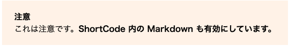

# ショートコードの実装

---

## ショートコードとは

[ショートコード](https://gohugo.io/content-management/shortcodes/)は、記事ファイル（Markdown ファイル）から呼び出せるカスタムスニペットです。
Markdown はシンプルな分、表現力が乏しいですが、ショートコードを使うと Markdown にはできないスタイルを追加できます。

HUGO では[標準のショートコード](https://gohugo.io/content-management/shortcodes/#use-hugos-built-in-shortcodes)が用意されていますが、自分で[カスタムショートコード](https://gohugo.io/templates/shortcode-templates/)を実装できます。

- ショートコードの例
    - 「注意書き」や「ヒント」などの説明ブロック
    - 言語ごとに、記事の内容を表示/非表示にする

## 「注意書き」の実装

注意書きができるショートコード「warning」を作ってみましょう。
「注意」という文言は言語ごとに表示を切り替えられるようにします。

- 完成イメージ 
  

### ショートコードファイルの作成

1. `themes/mythemes/layouts/` の下に「shortcodes」ディレクトリを作成します。
2. 「shortcodes」ディレクトリの下に、次の内容で「warning.html」を作成します。

        :::hugo
        <aside class="warning">
          

            {{ with .Site.Params.caption_warning }}{{ . }}{{ end }}
          

          

            {{ .Inner | markdownify }}
          

        </aside>

!!! Note
    - HTML のファイル名がショートコード名です。

### スタイルシートの調整

`themes/mytheme/static/css/default.css` を開き、次の内容を追記します。

    :::css
    .warning {
      background: #fff4ea;
      margin: 1rem 0;
      padding: 24px;
    }

    .warning-alt {
      font-weight: 600;
      margin-bottom: 8px;
    }

### 言語による表示の切り替え

表示する言語によって、「注意」となっているタイトルを切り替えできるようにします。

`config.toml` を開き、黄色の部分を追記します。

    :::toml hl_lines="9 18 27"
    [languages]
    [languages.en]
    weight = 1
    title = "Hugo tutorial"
    LanguageName = "English"
    contentDir = "content/en"
    languageCode = "en-us"
    search_placeholder = "Enter search keywords"
    caption_warning = "Caption"

    [languages.ja]
    weight = 2
    title = "Hugoチュートリアル"
    LanguageName = "日本語"
    contentDir = "content/ja"
    languageCode = "ja-jp"
    search_placeholder = "検索キーワードを入力"
    caption_warning = "注意"

    [languages.zh]
    weight = 3
    title = "Hugo教程"
    LanguageName = "中文(简体)"
    contentDir = "content/zh"
    languageCode = "zh-cn"
    search_placeholder = "输入搜索关键字"
    caption_warning = "注意"

### ショートコードの呼び出し

`content/ja/sample.md` に次を記述します。
言語によってタイトル（「注意」の部分）が変わるかについても、`content/en/sample.md` や `content/zh/sample.md` にも同様に記述して確認してみましょう。

    :::hugo
    
    これは注意です。**ShortCode 内の Markdown も有効にしています。**
    

!!! Note
    - ショートコードは `` と書くことで利用できます。
    - タグで囲った部分は、ショートコードファイルの `.Inner` で取り出しています。

## 特定言語でのみ表示する説明ブロックの実装

「英語の記事では表示して、日本語や中国語の記事では表示しない」といった、特定言語でのみ内容を表示できるようにしてみましょう。

### ショートコードファイルの作成

1. `themes/mythemes/layouts/` の下に「shortcodes」ディレクトリを作成します。
2. `themes/mythemes/layouts/shortcodes` の下に、次の内容で「description.html」を作成します。

        :::hugo
        {{ if in .Params .Site.Language.Lang }}
          {{ .Inner | markdownify }}
        {{ end }}

### ショートコードの呼び出し

`content/ja/sample.md` に次を記述します。
言語によってタイトル（「注意」の部分）が変わるかについても、`content/en/sample.md` や `content/zh/sample.md` にも同様に記述して確認してみましょう。

    :::hugo
    
    この記述は日本語版と英語版でのみ表示されます。
    

!!! Note
    - ショートコード名の後の値（`ja en`）は `.Params` で取り出せます。
      - スペース区切りにしているので取り出した値は配列に格納されています。
      - [`in`](https://gohugo.io/functions/in/) で配列内に現在表示している言語が含まれるか？をチェックして、存在すれば表示します。
