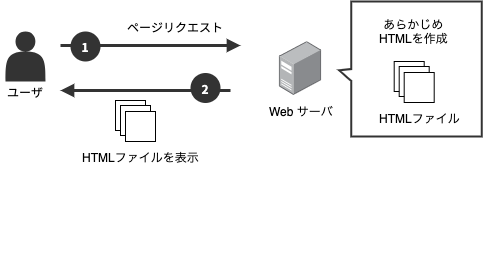
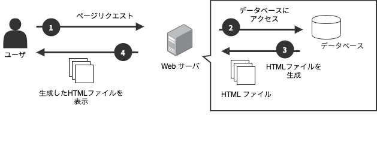

# HUGO ハンズオン

## HUGO とは
[HUGO](https://gohugo.io/) は、Go 言語製の静的サイトジェネレータ（Static Site Generator; SSG）です。
Markdown 形式[^1] で書かれた記事ファイルを、テーマテンプレートと呼ばれる HTML ファイルと一緒にビルドすることで、記事ページやリストページなどの HTMLファイルを生成します。

## 静的サイトと動的サイト

**静的サイト**は、あらかじめ作成しておいた静的ファイル（HTMLファイル）をユーザーに配信します。

**動的サイト**は、ユーザーからのリクエストに応じて、サーバでコンテンツ（HTMLファイル）を生成し、ユーザーに配信します。

動的サイトと比べ静的サイトには次のメリットがあります。

- ページの表示速度が早い
    - 静的サイトは、あらかじめ作成済みのページを表示する。
    - 動的サイトは、ユーザーのリクエストに応じてページを生成する必要がある。
- 運用コストが低い
    - 静的サイトは、静的ファイルを置く場所（例：S3など）があれば配信できる。
    - 動的サイトは、ページを生成するプログラムを動かすサーバや DB が必要。サーバメンテナンスも必要となる。
- セキュリティにつよい
    - 動的サイトはプログラムの実行・DBの管理を伴うので、セキュリティ対策が必要になる。

[^1]: HTML など Markdown 以外のフォーマットも対応しています（[Content Formats
](https://gohugo.io/content-management/formats/)）。
